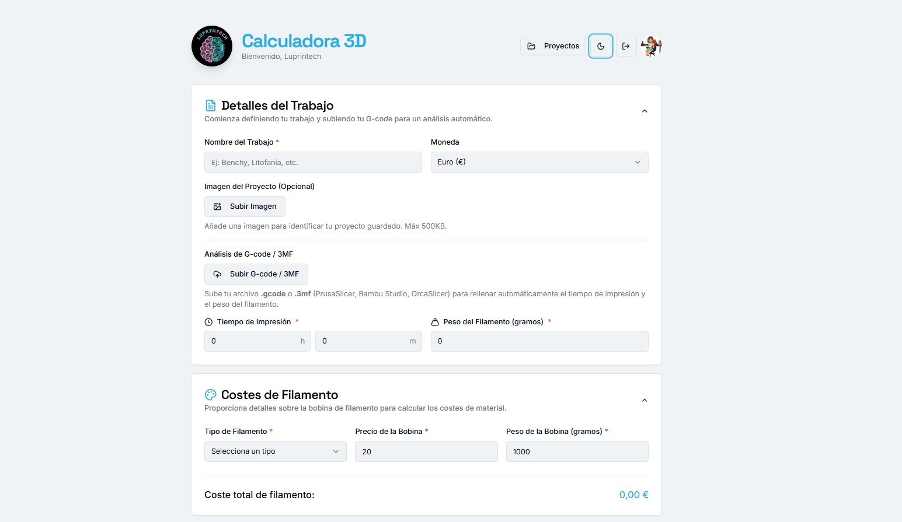
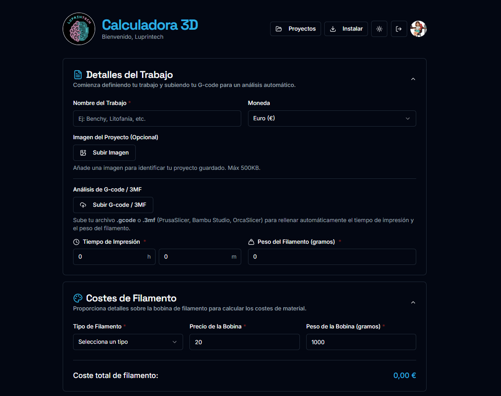

# Calculadora 3D — Luprintech

<p align="center">
  
  
  
  
  
  
  
  
  
</p>

Herramienta web para calcular el coste real de impresiones 3D. Incluye análisis de archivos G-code con IA, gestión de proyectos por usuario y soporte para múltiples divisas.

## Imagen de la aplicacion
<p align="center">
  
</p>

<p align="center">
  
</p>

## Características

- **Cálculo de costes completo** — filamento, electricidad, mano de obra, amortización de máquina y otros gastos
- **Análisis G-code con IA** — sube un archivo G-code y la IA extrae automáticamente el tiempo de impresión y el peso de filamento
- **Gestión de proyectos** — guarda, carga y elimina proyectos por cuenta de usuario
- **Login con Google** — autenticación OAuth 2.0, sin contraseñas
- **Compartir e imprimir** — exporta el resumen del presupuesto
- **Instalable como PWA** — instálala en móvil o escritorio como aplicación nativa
- **Tema claro / oscuro** — sigue la preferencia del sistema
- **Diseño responsive** — funciona en móvil y escritorio
- **Privacidad y cookies** — aviso legal conforme a RGPD y LSSI (UE/España)

---

## Stack tecnológico

| Capa | Tecnología |
|---|---|
| Frontend | React 18 + TypeScript + Vite |
| Backend | Express.js + Node.js |
| Base de datos | SQLite (archivo local `data.db`) |
| Autenticación | Passport.js + Google OAuth 2.0 |
| IA / G-code | Google Genkit + Google AI (Gemini) |
| UI | Tailwind CSS + shadcn/ui (Radix UI) |
| Formularios | React Hook Form + Zod |

---

## Requisitos previos

- Node.js 18 o superior
- Una cuenta de Google Cloud (para el OAuth)
- Una API key de Google AI Studio (para el analizador G-code)

---

## Instalación

```bash
# 1. Clona el repositorio
git clone https://github.com/luprintech/calculadora-3D.git
cd calculadora-3D

# 2. Instala todas las dependencias (frontend + backend)
npm install

# 3. Crea el archivo de variables de entorno
cp backend/.env.example backend/.env
```

---

## Configuración

### Variables de entorno (`backend/.env`)

```env
# Google OAuth 2.0
GOOGLE_CLIENT_ID=tu-client-id.apps.googleusercontent.com
GOOGLE_CLIENT_SECRET=tu-client-secret

# Clave de sesión (cadena aleatoria larga)
SESSION_SECRET=cadena-aleatoria-muy-larga

# URL del frontend (en desarrollo no cambies esto)
CLIENT_ORIGIN=http://localhost:9002

# Google AI Studio — para el analizador de G-code
GOOGLE_GENAI_API_KEY=AIzaSy...
```

### Generar SESSION_SECRET

```bash
node -e "console.log(require('crypto').randomBytes(64).toString('hex'))"
```

### Configurar Google OAuth

1. Ve a [Google Cloud Console](https://console.cloud.google.com) → **APIs & Services** → **Credentials**
2. **Create Credentials** → **OAuth 2.0 Client ID** → tipo: **Web application**
3. En **Authorized redirect URIs** añade:
   ```
   http://localhost:9002/api/auth/google/callback
   ```
4. Copia el **Client ID** y **Client Secret** a `backend/.env`

### Obtener la API key de Google AI

1. Ve a [Google AI Studio](https://aistudio.google.com/app/apikey)
2. Crea una nueva API key
3. Cópiala en `GOOGLE_GENAI_API_KEY` de `backend/.env`

---

## Arrancar en desarrollo

```bash
npm run dev
```

Lanza en paralelo:
- **Frontend** (Vite): `http://localhost:9002`
- **Backend** (Express): `http://localhost:3001`

La base de datos SQLite (`backend/data.db`) se crea automáticamente al arrancar el servidor.

---

## Scripts disponibles

| Comando | Descripción |
|---|---|
| `npm run dev` | Arranca frontend + backend en modo desarrollo |
| `npm run build` | Compila el frontend para producción |
| `npm start` | Arranca el servidor Express (producción) |
| `npm run typecheck` | Comprueba tipos TypeScript |

---

## Estructura del proyecto

```
calculadora-3D/
├── package.json               # Raíz: npm workspaces + scripts
├── frontend/                  # Todo el frontend (React + Vite)
│   ├── package.json
│   ├── tsconfig.json
│   ├── vite.config.ts         # Proxy /api → :3001
│   ├── tailwind.config.ts
│   ├── index.html
│   ├── public/
│   │   └── Logo.svg
│   └── src/
│       ├── components/
│       │   ├── ui/                    # Componentes shadcn/ui
│       │   ├── calculator-form.tsx
│       │   ├── login-page.tsx
│       │   ├── print-summary.tsx
│       │   ├── saved-projects-dialog.tsx
│       │   ├── cookie-banner.tsx      # Banner aviso de cookies
│       │   └── privacy-policy-modal.tsx  # Política de privacidad
│       ├── context/
│       │   └── auth-context.tsx       # Contexto de autenticación
│       ├── hooks/
│       │   ├── use-cookie-consent.ts  # Gestión consentimiento cookies
│       │   └── use-pwa-install.ts     # Instalación PWA
│       ├── lib/
│       │   ├── schema.ts              # Validación Zod
│       │   ├── defaults.ts            # Valores por defecto
│       │   ├── projects.ts            # CRUD proyectos (API REST)
│       │   └── utils.ts
│       ├── App.tsx
│       ├── main.tsx                   # Registro service worker PWA
│       └── index.css
│   public/
│       ├── Logo.svg
│       ├── manifest.json              # Manifiesto PWA
│       └── sw.js                      # Service worker (PWA)
└── backend/                   # Todo el backend (Express)
    ├── package.json
    ├── tsconfig.json
    ├── .env                   # Variables de entorno (no en git)
    ├── .env.example
    ├── data.db                # Base de datos SQLite (generada)
    └── src/
        └── index.ts           # Express: OAuth, proyectos, GCode API
```

---

## API del servidor

| Método | Ruta | Descripción |
|---|---|---|
| GET | `/api/auth/google` | Inicia el flujo OAuth con Google |
| GET | `/api/auth/google/callback` | Callback OAuth (redirige Google aquí) |
| GET | `/api/auth/logout` | Cierra la sesión |
| GET | `/api/auth/user` | Devuelve el usuario autenticado |
| GET | `/api/projects` | Lista los proyectos del usuario |
| POST | `/api/projects` | Guarda un nuevo proyecto |
| DELETE | `/api/projects/:id` | Elimina un proyecto |
| POST | `/api/analyze-gcode` | Analiza un archivo G-code con IA |

---

## Cálculo de costes

```
Coste filamento  = (peso usado / peso bobina) × precio bobina
Coste eléctrico  = (vatios / 1000) × horas × coste kWh
Coste mano obra  = (tiempo prep / 60 × tarifa) + (tiempo post / 60 × tarifa)
Amortización     = coste impresora / (años × 365 × 8 h) × horas impresas + reparación

Subtotal         = filamento + electricidad + mano de obra + máquina + otros
Beneficio        = subtotal × (% beneficio / 100)
Base IVA         = subtotal + beneficio
IVA              = base IVA × (% IVA / 100)
Precio final     = base IVA + IVA
```

---

## PWA — Instalar como aplicación

La app es una **Progressive Web App (PWA)**. Al acceder desde Chrome o Edge (Android/escritorio), aparecerá automáticamente el botón **"Instalar"** en la cabecera. En iOS/Safari se puede instalar desde el menú compartir → *Añadir a pantalla de inicio*.

---

## Privacidad y cookies

La aplicación utiliza únicamente **cookies técnicas** necesarias para la autenticación (cookie de sesión). No se emplean cookies de seguimiento ni publicidad.

El aviso de cookies y la política de privacidad completa (conforme a RGPD y LSSI) están accesibles desde el banner de primera visita y el enlace en el pie de página.

**Responsable:** Guadalupe Cano · luprintech@gmail.com
**Autoridad de control:** [Agencia Española de Protección de Datos (AEPD)](https://www.aepd.es)

---

## Contacto

- YouTube: [@Luprintech](https://www.youtube.com/@Luprintech)
- Instagram: [@luprintech](https://www.instagram.com/luprintech/)
- TikTok: [@luprintech](https://www.tiktok.com/@luprintech)
- GitHub: [luprintech](https://github.com/luprintech)
- Email: luprintech@gmail.com

---

© 2025 Guadalupe Cano. Todos los derechos reservados.
